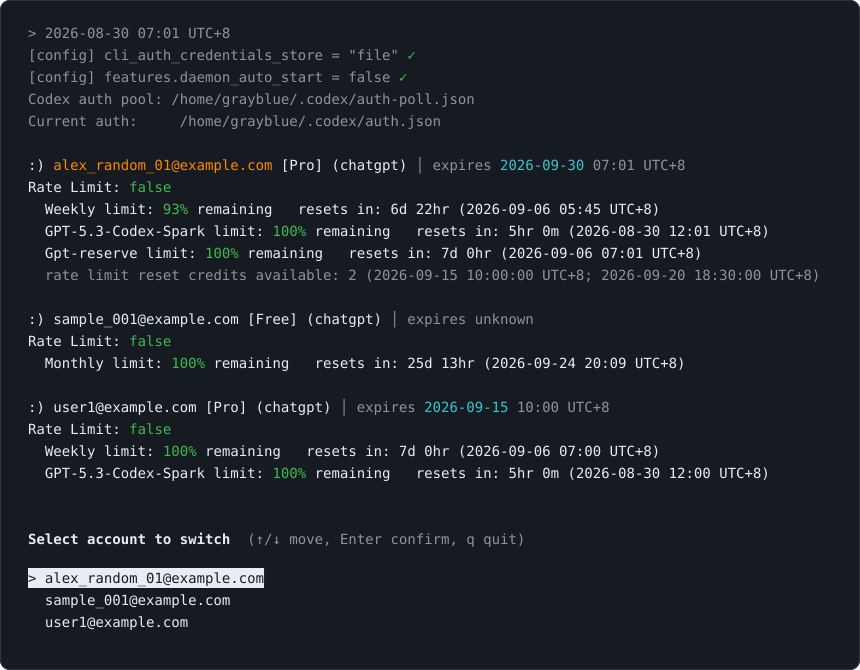

# codex-auth

Lightweight yet full‑featured – a Bash tool that pools credentials, displays usage, enables interactive switching, and auto‑syncs, making Codex CLI multi‑account management effortless.



## Features

- Automatically syncs the current `~/.codex/auth.json` to the credential pool
- Displays usage and reset times for ChatGPT accounts
- Provides an interactive account picker
- Removes inactive accounts from the credential pool with confirmation
- Adds newly authenticated accounts to the pool automatically
- Leaves Codex sessions, history, and other data untouched

## Requirements

- Bash
- `jq`
- `curl`
- [Codex CLI](https://github.com/openai/codex) (required when adding an account)
- Python 3 (used to parse some timestamps and account details)

## Installation

Run the script directly:

```bash
chmod +x codex-auth.sh
./codex-auth.sh
```

Or install it in your local binary directory:

```bash
mkdir -p ~/.local/bin
install -m 755 codex-auth.sh ~/.local/bin/codex-auth
```

Make sure `~/.local/bin` is included in your `PATH`.

## Usage

```bash
# List accounts and usage
codex-auth

# Log in and save a new account
codex-auth login

# Switch accounts interactively
codex-auth switch

# Remove an inactive account from the pool interactively
codex-auth remove
```

In the account picker, use `↑` / `↓` to move, `Enter` to confirm, and `q` to quit.
For removal, confirm with `y`. Switch away from the active account before removing it, or the next run will add it back from `auth.json`.

Default file locations:

| File | Path |
| --- | --- |
| Current credentials | `~/.codex/auth.json` |
| Credential pool | `~/.codex/auth-poll.json` |
| Codex configuration | `~/.codex/config.toml` |

Override these paths with the `CURRENT_AUTH_FILE`, `AUTH_POOL_FILE`, and `CONFIG_TOML` environment variables.

Proxy settings are inherited from `HTTP_PROXY` and `HTTPS_PROXY`. If either is unset, the script also accepts its lowercase equivalent (`http_proxy` or `https_proxy`) and exports the uppercase value to child commands.

> [!WARNING]
> The credential pool contains access tokens or API keys. Do not share it or commit it to version control. The script sets its permissions to `600`. Running `codex-auth login` backs up the current credentials before starting a new Codex login flow.

## License

[MIT](LICENSE)
