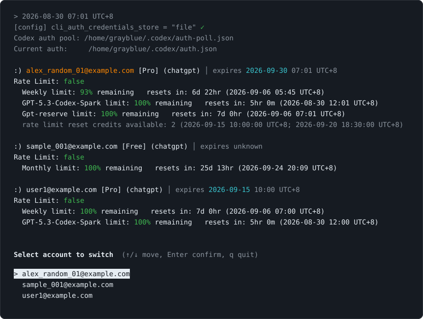

# codex-auth

A Bash tool for managing Codex CLI accounts, checking usage, and switching accounts.



## Features

- Saves accounts automatically when you log in
- Displays usage and reset times for ChatGPT accounts
- Switches accounts through an interactive picker
- Cleans up saved accounts through an interactive picker
- Retains saved sessions and history

## Requirements

Supports Linux and macOS.

- Bash 3.2 or later (the built-in macOS Bash is supported)
- `jq`
- `curl`
- Lastest [Codex CLI](https://github.com/openai/codex)
- Python 3

## Installation

Run the script directly:

```bash
chmod +x codex-auth.sh
./codex-auth.sh
```

Or install it in your local binary directory:

```bash
mkdir -p ~/.local/bin
install -m 755 codex-auth.sh ~/.local/bin/codex-auth
```

Make sure `~/.local/bin` is included in your `PATH`.

## Usage

```bash
# List accounts and usage
codex-auth

# Log in and save a new account
codex-auth login

# Switch accounts interactively
codex-auth switch

# Remove a saved account interactively
codex-auth clean
```

In the account picker, use `↑` / `↓` to move, `Enter` to confirm, and `q` to quit.
To clean the current account, switch to another account first.

Finish running Codex tasks before switching accounts or logging in. Account changes may interrupt active sessions; reconnect or resume them afterwards if needed.

Data is stored in `~/.codex` by default. Set `CODEX_HOME` to use another Codex data directory.

> [!WARNING]
> The account pool contains sensitive credentials. Do not share it or commit it to version control.

## License

[MIT](LICENSE)
